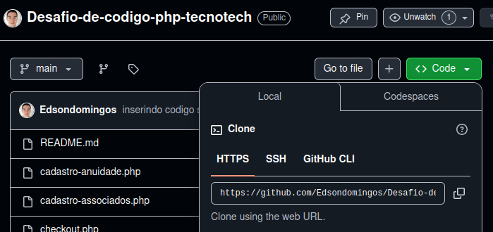
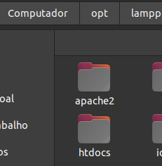
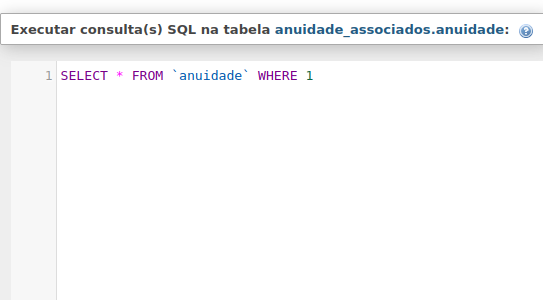
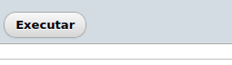
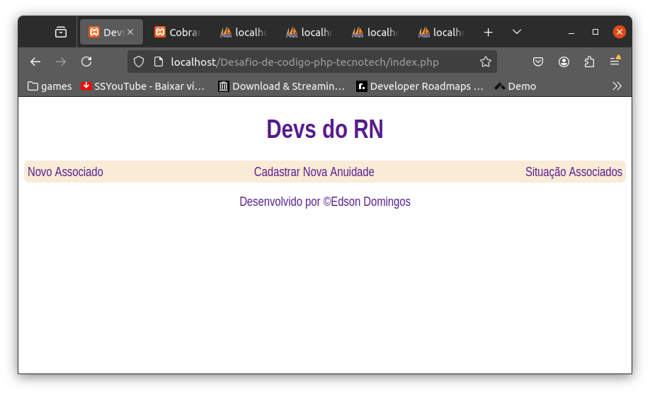

# Desafio-de-codigo-php-tecnotech
Desafio de codigo para a Vaga dev php 2024.2 na tecnotech.

### PHP PURO, sem framework

## Utilidade gerais
*Servidor web com o intuito de gerencia anuidades de associados.*

*É possivel:*

1. Adicionar associados (nome,email,cpf e data de afiliação);
2. Cadastrar Anuidade (Data e Valor);
3. Ver situação de associados (anuidades pagas e anuidade devedoras);
4. Pagar uma ou varias anuidades;

## Ferramentas necessárias teste/uso
1. Instale o Xampp (Apache e Mysql) - [baixar xampp](https://www.apachefriends.org/pt_br/index.html)
2. Navegador Web (chrome, firefox, Edge ...)
3. [Repositorio do codigo (baixe)](https://github.com/Edsondomingos/Desafio-de-codigo-php-tecnotech)

### Com Xampp já instalado
### Arquivos
Baixe os arquivos deste reposito
1. Adicione o diretorio/pasta baixada deste repositorio no diretorio/pasta **htdocs** ou **www** (dependendo da versão do xampp) que esta dentro da pasta criado do xampp apos ser instalado (**NÃO ESQUECE DE ATIVAR O APACHE E MYSQL NO XAMPP**)

#### Banco de dados
2. Acesse **localhost/phpmyadmin** 

3. Clique nos 3 traços (|||) horizontais e escolha **SQL**.

4. Copie o código do arquivo **meu_database.sql** que você baixou junto com este repositorio e cole no espaço de codigo e depois clique em executar.

#### Final
5. Abra o seu navegador e digite **localhost/Desafio-de-codigo-php-tecnotech** (se o nome da sua pasta que contem os arquivos for outro, substitua pelo nome após **localhost/**)
 
6. A página inicial do site já deve abrir!

7. Aproveite!
